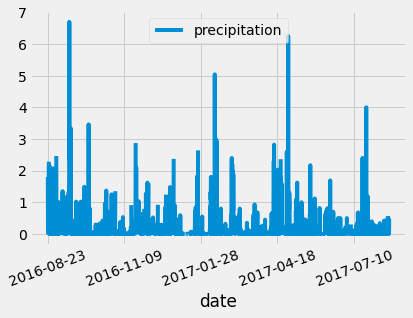

# surfs_up
Using Python, Jupyter Notebook, SQLite, Flask, SQLAlchemy

## Overview

In Oahu Hawaii, we have proposed to open a "Surf n' Shake" store that will sell surfing equipment and ice cream. In order to receive financial support from investors, we have to confirm that the weather in Oahu is usually warm and sunny. In other words, the average temperature in the summer needs to be near 70 degrees, and there cannot be frequent rain falls. 

The data was loaded into jupyter notebook from a SQLite database. From there, the data was analyzed, and then uploaded to a customized webpage using flask.

## Results

Below are the statistics for June and December temperatures. The histograms illustrate that the majority of temperatures are within 65-85 degrees, which is just what we will need for the ice cream shop. Since this data is based on over a 1,000 observations made over several years, we can trust that this data is reliable and will remain this way for years to come. 

### June Data

### December Data

### Precipitation Data

The precipitation data is summarized in three images below. The table shows that the mean is roughly 0.2 mm. This is a low number for precipitation. Notice that the standard deviation is almost 3 times that of the mean. This tells us that there are large fluctuations in the precipitation levels. Since the count is over 2,000 measurements, the data is a reliable sample of the weather.

The histogram visualizes the table, and shows us that the vast majority of the measurements are low. In the time series plot, the high levels of precipitation occur each year, but the time of year appears to be random. The "Surf n' Shake" shop will have a few rainy days each year, but not enough to prevent the shop's success.

### Flask

Here is a screenshot of the homepage. If the precipitation extention is added to the browser, the webpage containing the precipitation data is opened. 

## Conclusion

From the data collected, the "Surf n' Shake" is almost a guaranteed success. The temperatures are warm even in the winter season, and the rain will rarely dampen the store's success. 
